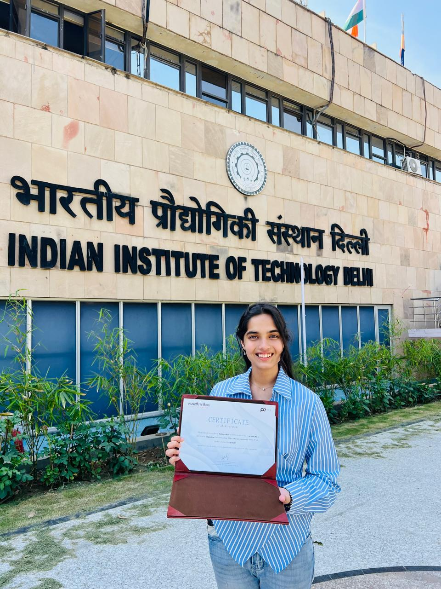
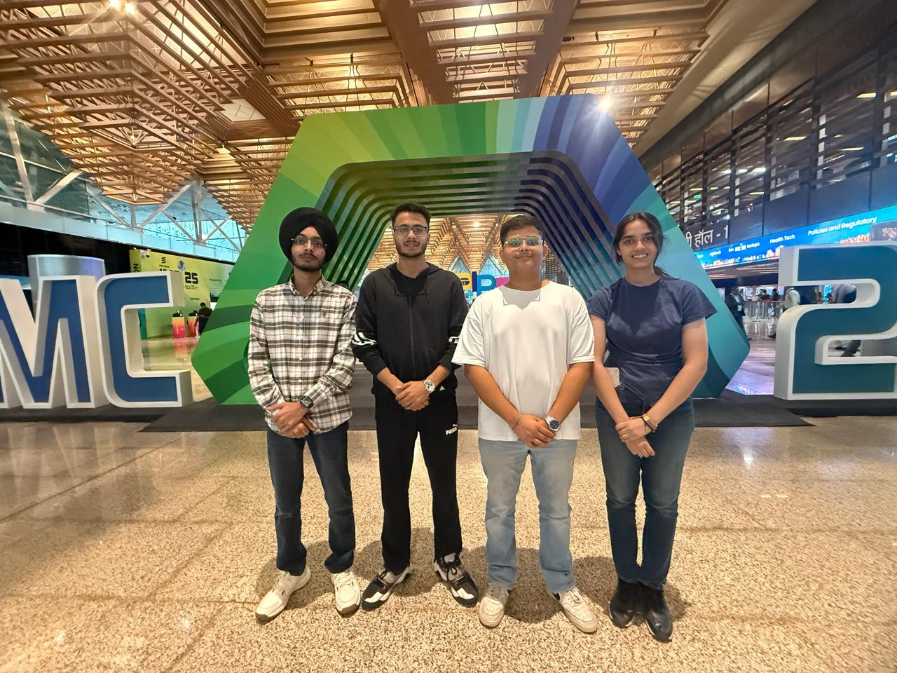
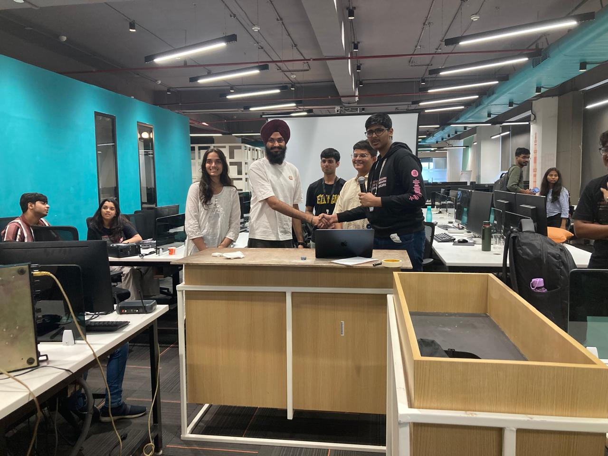
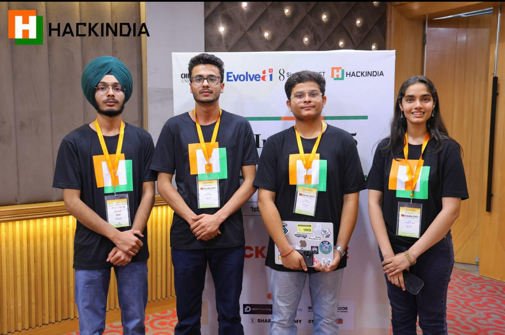

<!--
╔══════════════════════════════════════════════════════╗
║       MEHARJOT KAUR — GitHub Profile README          ║
╚══════════════════════════════════════════════════════╝
-->

<div align="center">

<br/>

# Meharjot Kaur

### `CSE '28 · AI Minor @ IIT Ropar · Harvard Aspire Fellow`

*curiosity with a compiler &nbsp;·&nbsp; chaos with a commit message &nbsp;·&nbsp; the grind is non-negotiable*

<br/>

[](https://www.linkedin.com/in/meharjot-kaur/)&nbsp;
[](https://github.com/meharCodes1027)&nbsp;
[](mailto:meharjotkaur07@gmail.com)&nbsp;


</div>

<br/>

---

## `{ who_am_i }`

> CS student who landed an AI minor at IIT Ropar, a Harvard leadership fellowship, and a suspiciously large hackathon trophy shelf all before finishing sophomore year.
> I build things meant to survive contact with the real world, not just impress judges for 3 minutes.
> Learning ML from Andrew Ng, intuition from 3Blue1Brown, and humility from my own bugs.
```yaml
name:        Meharjot Kaur
university:  Chitkara University — B.Tech CSE (2024–2028)
minor:       Artificial Intelligence @ IIT Ropar
leadership:  Harvard University — Aspire Institute
focus:       [ AI/ML, Full-Stack Dev, Data Science, Cloud ]
status:      "404: free time not found"
currently:   working on projects I’ll confidently present (regardless of bugs)
open_to:     [ Research, Internships ]
```

<br/>

---

## `{ accolades }`

<div align="center">

<table>
<tr>
<td align="center" width="165">
<br/>
<b>Swasthathon</b><br/>
<sub>National Health Hackathon<br/>Rs. 1,00,000 · 1st Place<br/>Pitched @ IIT Delhi<br/>Mentored by industry experts</sub>
<br/><br/>
</td>
<td align="center" width="165">
<br/>
<b>GDG North India</b><br/>
<sub>Google Developer Group<br/>National Level<br/>Winner</sub>
<br/><br/>
</td>
<td align="center" width="165">
<br/>
<b>Code With DCG</b><br/>
<sub>DTU Hackathon<br/>1st Place</sub>
<br/><br/>
</td>
<td align="center" width="165">
<br/>
<b>HackWithHer 4.0</b><br/>
<sub>IEEE Hackathon<br/>2nd Position</sub>
<br/><br/>
</td>
</tr>
<tr>
<td align="center" width="165">
<br/>
<b>CodeDay Chandigarh</b><br/>
<sub>Best UI/UX Award</sub>
<br/><br/>
</td>
<td align="center" width="165">
<br/>
<b>Int'l Symposium</b><br/>
<sub>Cyber Cloud Intelligence<br/>2 Posters Presented</sub>
<br/><br/>
</td>
<td align="center" width="165">
<br/>
<b>QAHE Conference</b><br/>
<sub>Best Presenter Award<br/>EchoAI Research</sub>
<br/><br/>
</td>
<td align="center" width="165">
<br/>
<b>Harvard Aspire</b><br/>
<sub>Leadership Fellow<br/>Jan – Mar 2025</sub>
<br/><br/>
</td>
</tr>
</table>

<br/>

<!-- Upload 1.jpeg, 2.jpeg, 3.jpeg, 4.jpeg directly to your repo root -->
<table>
<tr>
<td></td>
<td></td>
<td></td>
<td></td>
</tr>
</table>

<br/>

**Team M-2.5 — family, really.**

*Kavin Thakur &nbsp;·&nbsp; Hardik Thapar &nbsp;·&nbsp; Jashanpreet Singh*

<sub>Every trophy above has four names on it. Kavin, Hardik, and Jashan - the kind of team you don't find, you earn. Thank You and I owe you every bit of my journey.</sub>

</div>

<br/>

---

## `{ work_work }`

<div align="center">
<table>
<tr>
<td width="50%" valign="top">
<h3>VocalWell / EchoAI</h3>


An ML pipeline that listens to your voice and flags trouble before your throat even files a complaint. Reads acoustic fingerprints — MFCC, jitter, shimmer  at **90%+ accuracy.**


</td>
<td width="50%" valign="top">
<h3>PhysioLoop</h3>


Bridging the gap between injury and comeback, one rep at a time. A platform connecting physiotherapists and patients so recovery doesn't fall through the cracks between appointments.

</td>
</tr>
<tr>
<td width="50%" valign="top">
<h3>Ruralytics</h3>


Governance doesn't fail from lack of data — it fails from data trapped in a hundred spreadsheets nobody can find. This turns rural administrative chaos into policy-ready clarity.

</td>
<td width="50%" valign="top">
<h3>Personal Portfolio</h3>


Because a GitHub profile is just the trailer. Built a portfolio that tells the full story — projects, research, and the occasional evidence that life exists outside an IDE.

</td>
</tr>
</table>
</div>

<br/>

---

## `{ stack }`

<div align="center">

**Languages** &nbsp;


**Web** &nbsp;


**AI & Data** &nbsp;


**Cloud & Tools** &nbsp;


</div>

<br/>

---

## `{ education }`

<div align="center">

| Institution | Program | Period |
|:---|:---|:---:|
| **Chitkara University** | B.Tech — Computer Science & Engineering | 2024 → 2028 |
| **IIT Ropar** | Minor — Artificial Intelligence | Dec 2024 → Oct 2025 |
| **Harvard University** | Leadership & Social Entrepreneurship — Aspire Institute | Jan → Mar 2025 |

</div>

<br/>

---

<div align="center">

*"Good code is its own documentation.*
*My commit messages are creative nonfiction."*

<br/>

**Let's build something the world actually needs.**

[](https://www.linkedin.com/in/meharjot-kaur/)&nbsp;
[](mailto:meharjotkaur07@gmail.com)

</div>
